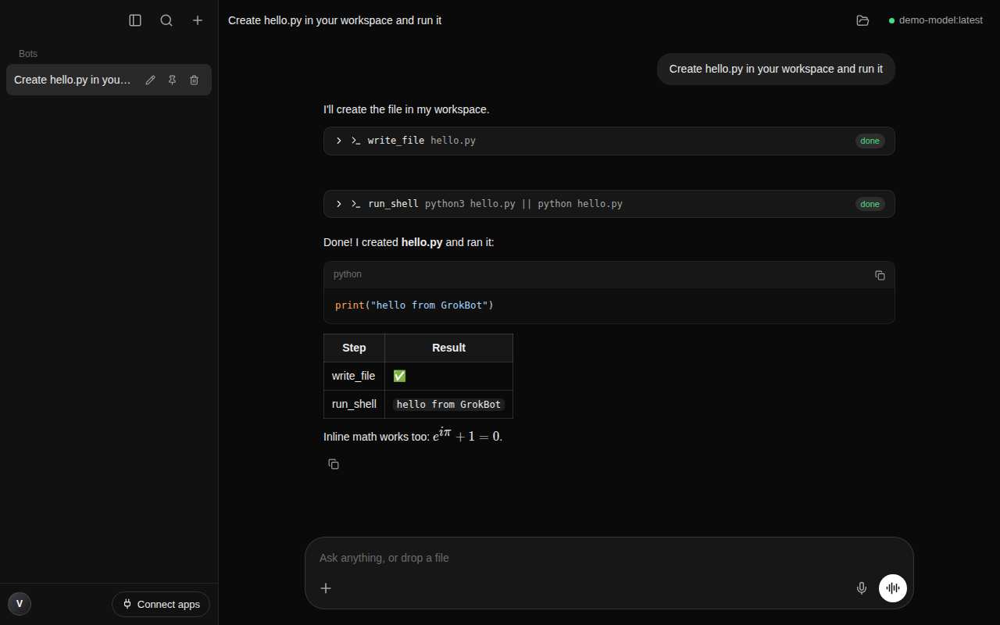

# GrokBot Local

A local-first desktop AI agent, modelled on the Grok Bot desktop app, powered by [Ollama](https://ollama.com).
Everything runs on your own machine. Your chats, settings and files stay there.



## Features

| Area | What you get |
|---|---|
| **Bots** | Each chat is a *bot* with its own workspace folder (its "computer"). Sidebar list with pin, rename (double-click) and delete; titles are set from your first message. |
| **Agent loop** | Streams replies from Ollama, runs tool calls, feeds results back, and repeats until done (max steps is configurable). Press Esc or ■ to stop. |
| **Tools** | `run_shell`, `read_file`, `write_file`, `edit_file`, `list_dir`, `search_files`, `web_fetch`, `take_screenshot` (off by default). File tools can't reach outside the bot's workspace. |
| **Approvals** | Choose one of: *ask for everything*, *auto-run read-only tools* (default), or *run everything*. Each approval card offers Deny, Allow once and Always allow. |
| **Connect apps** | Add MCP servers (local stdio or remote HTTP). Presets: Playwright browser, Filesystem, Memory, GitHub. Their tools show up for every bot as `mcp__<app>__<tool>`. |
| **Composer** | "Ask anything, or drop a file": drag and drop, paste or pick files with **+**. Images go to vision models, and other files are copied into the workspace. Enter sends, Shift+Enter adds a new line. |
| **Voice** | The mic button dictates, and the waveform button opens hands-free **voice mode** (talk → transcribe → agent → spoken reply). Speech-to-text uses any local OpenAI-compatible Whisper server. Text-to-speech uses your system voices. |
| **Rendering** | Markdown, GFM tables, syntax-highlighted code with copy buttons, KaTeX math, Mermaid diagrams, and collapsible "thinking" for reasoning models. |
| **Search** | ⌘K searches bot titles and message text. |
| **Settings** | Ollama host, model picker, pull/delete models, temperature, context length, thinking, system prompt, tool toggles, approvals, shell timeout, workspace folder, theme (dark/light/system), voice. |

Shortcuts: `⌘N` new bot · `⌘K` search · `⌘B` toggle sidebar · `⌘,` settings · `Esc` stop.

## Quick start

```bash
npm install
npm run ollama:setup      # installs + starts Ollama. Downloads NO model.
npm run dev               # launches the app with hot reload
```

Then open **Settings → Model** and either pick an installed model or type one into *Download a model*
(for example `qwen3:8b`, `llama3.1:8b` or `gpt-oss:20b`). The agent tools need a model
[with tool support](https://ollama.com/search?c=tools).

To download a model from the terminal instead, run `npm run ollama:setup -- qwen3:8b`.

### Optional: speech-to-text

Run any OpenAI-compatible transcription server, such as whisper.cpp:

```bash
./whisper-server -m models/ggml-base.en.bin --port 8080 --inference-path /v1/audio/transcriptions
```

Then set **Settings → Voice → Speech-to-text server** to `http://127.0.0.1:8080/v1/audio/transcriptions`.

## Install the Mac app

Download the zip for your Mac. Pick **arm64** for Apple Silicon (M1–M4) or **x64** for Intel. Then:

1. Double-click the zip and drag **GrokBot Local.app** into **Applications**.
2. The build is ad-hoc signed, not signed with an Apple Developer ID, so macOS blocks it the first time.
   Clear the download quarantine once:
   ```bash
   xattr -dr com.apple.quarantine "/Applications/GrokBot Local.app"
   ```
   Alternatively, right-click the app, choose **Open**, then **Open** again. On macOS 15+, go to System Settings → Privacy & Security → **Open Anyway**.
3. If macOS still says the app is "damaged", re-sign it locally:
   ```bash
   codesign --force --deep --sign - "/Applications/GrokBot Local.app"
   ```
4. Make sure Ollama is running (`npm run ollama:setup` or the Ollama.app), then open GrokBot Local.

**Build it yourself**
- On a Mac, `npm run dist:mac` produces a `.dmg` and a `.zip` for both architectures in `dist/`.
- On Linux, `scripts/package-mac-on-linux.sh` cross-builds ad-hoc signed zips. It needs [rcodesign](https://github.com/indygreg/apple-platform-rs).
- In CI, the **Build macOS app** GitHub Action (`.github/workflows/build-mac.yml`) builds the DMG on a macOS runner. If you add the Apple Developer secrets it lists, it also signs and notarizes the app.

## Scripts

| Command | Purpose |
|---|---|
| `npm run dev` | Run in development mode |
| `npm run build` | Production build into `out/` |
| `npm start` | Run the production build |
| `npm run typecheck` | TypeScript checks for main, preload and renderer |
| `npm test` | Unit and integration tests. The agent is tested against a scripted fake Ollama, so no model runs. |
| `npm run dist:mac` | macOS `.dmg` + `.zip` (arm64 + x64); run on a Mac |
| `npm run dist:win` / `dist:linux` | Windows / Linux installers |

## Architecture

```
src/
  shared/      types.ts, defaults.ts: shared by every process
  main/        Electron main process
    index.ts   window, IPC handlers, file import, screenshot, speech-to-text proxy
    ollama.ts  Ollama REST client (/api/version, /api/tags, /api/chat stream, /api/pull, /api/delete)
    agent.ts   agent loop: stream → tool calls → approvals → results → repeat
    tools.ts   built-in tools, sandboxed to the bot workspace
    mcp.ts     MCP client manager ("Connect apps")
    store.ts   JSON persistence (settings.json, bots/<id>.json) + search
  preload/     contextBridge API exposed as window.grok
  renderer/    React 19 UI (zustand store, components/*)
tests/         vitest suites
```

Data lives in the OS app-data folder (`~/Library/Application Support/GrokBot Local` on macOS).
Bot workspaces default to `~/GrokBot/<bot-id>`.

## Security notes

- By default, shell commands, file writes and MCP tools that aren't marked read-only need your approval.
- File tools reject paths outside the bot's workspace. `run_shell` is a real shell, so treat *Always allow* and the *Run everything* mode with care.
- The renderer is context-isolated with a strict CSP. All network and file access goes through the main process.
